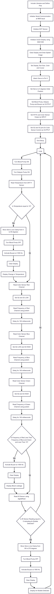

# Hemodialysis Safety Monitoring System

## 📌 Overview
This project is an **Arduino-based hemodialysis safety monitoring system** designed to enhance patient safety during dialysis sessions. The system monitors:
- **Temperature** of blood/dialysate
- **Blood leakage** in tubing
- **Air bubble presence**

When anomalies are detected, it **stops pumps**, **clamps the line with a servo motor**, and **triggers visual and audible alarms**.

---

## ✅ Features
- **Temperature Monitoring** (DHT11 sensor)
- **Blood Leakage Detection** (TCS3200 color sensor)
- **Air Bubble Detection** (IR sensor)
- **Automatic Servo-Controlled Line Clamp**
- **OLED Display** for system alerts
- **Audible Alarm** via buzzer
- **Dual Pump Control** for blood & dialysate flow

---

## 🛠 Hardware Components
| Component                     | Quantity |
|------------------------------|----------|
| Arduino Uno / Mega           | 1        |
| DHT11 Temperature Sensor     | 1        |
| TCS3200 Color Sensor         | 1        |
| IR Sensor                    | 1        |
| Servo Motor                  | 1        |
| OLED Display (SSD1306)       | 1        |
| Buzzer                       | 1        |
| Relay Module (for pumps)     | 2        |
| Blood Pump & Dialysis Pump   | 1 each   |
| Connecting Wires             | -        |

---

## 🔗 Circuit Connections
| Component      | Arduino Pin |
|---------------|------------|
| Blood Pump    | 12         |
| Dialysis Pump | 13         |
| Buzzer        | 11         |
| IR Sensor     | 2          |
| DHT11 Sensor  | 10         |
| Color Sensor  | S2 → 3, S3 → 4, OUT → 5 |
| Servo Motor   | 9          |
| OLED Display  | I²C (SDA → A4, SCL → A5) |

---

## 💻 Software Requirements
- **Arduino IDE** (v1.8.x or later)
- Required Libraries:
  - `Servo.h`
  - `DHT.h`
  - `Adafruit_GFX.h`
  - `Adafruit_SSD1306.h`

Install libraries via **Arduino IDE → Sketch → Include Library → Manage Libraries**.

---

## ⚙ How It Works
1. **Normal Mode:** Pumps run continuously.
2. **Temperature Check:** If temp ≠ safe threshold → Pumps OFF, Servo clamps line, Buzzer ON, OLED alert.
3. **Blood Leakage Detection:** Color sensor detects RED → Pumps OFF, Alarm ON.
4. **Air Bubble Detection:** IR sensor detects bubble → Pumps OFF, Line clamped, Alarm ON.
5. Alerts are shown on the OLED screen.

---

## 📊 System Block Diagram

---

## 🔌 Circuit Diagram

---

## 🔄 Flowchart

---

## 🖼 OLED Display Screens
- **Startup Logo**
- Alerts:
  - “Change in Temperature”
  - “Blood Leakage”
  - “Air Bubble”

---

## 📂 Code
The full Arduino code is available in `hemodialysis_safety.ino`.

---

## 🚨 Safety Considerations
- This system is **for educational and research purposes only** and not for real medical use without proper certification.
- Calibrate all sensors for accuracy.

---

## 📸 Demo
_Add your photos and videos here._

---

## 📜 License
This project is released under the **MIT License**.

